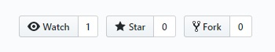

# Support Us

Do you like this project? Here are some ways to show us your ❤:

### Donation

Donations are very welcome. You can send us some money using one of the following links:
 * [YekPay Personal Gateway (€, £)](https://dashboard.yekpay.com/en/user/AmirrezaNasiri)
 * [Zarinpal Personal Gateway (تومان)](https://zarinp.al/@amirrezan)
 
### Send us a Postcard

We appreciate to receive a physical postcard from you or your company. We'll soon display all of them. Just leave me a message and I'll reply soon: `nasiri.amirreza.96@gmail.com` or [@Amirreza_Nasiri](https://twitter.com/amirreza_nasiri). 

 
### Star and Fork

By giving a star and forking this repository, people will find it easily. It'll take ~7s, just hit these buttons on [the repository](https://github.com/evryn/laravel-toman):

### Contribute

Knowing Laravel and package development? It would be very great if you could help us extend this project. See [Contribution Guide](contributing.md).

### Share it

Let people know about this package by simply sharing current URL or clicking here:

* [Share on Twitter](https://twitter.com/share?url=https://github.com/evryn/laravel-toman)
* [Share on Telegram](https://t.me/share/url?url=https://github.com/evryn/laravel-toman)
    
    
### Not a suitable one yet?

Don't worry at all! You can help us by making someone very very happy **today** 😊. We believe in Butterfly Effect.
