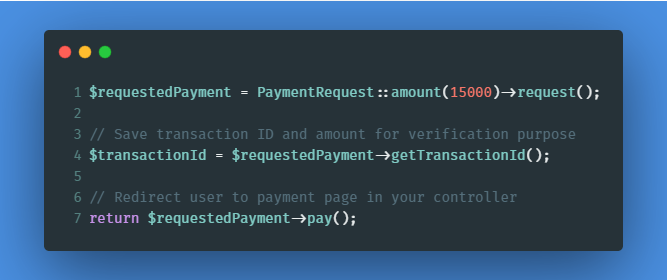
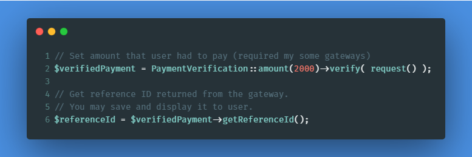

  <h1>Laravel Toman</h1>

  

  A painless payment handler!

    
    
    
    
    

    📚
    <a target="_blank" href="https://evryn.github.io/laravel-toman/">Read documents</a>
    and start using in <5m

# About Toman (تومَن)
Toman is a Laravel package which makes working with popular payment gateways much easier.

## Supported Gateways

✅ [Zarinpal.com](https://zarinpal.com)  
🔘 [YekPay.com](https://yekpay.com/)  
🔘 [Pay.ir](https://pay.ir/)  
🔘 [PayPing.ir](https://www.payping.ir/)  
🔘 ...

## Simple to use

Request new payment as easy as:

  

And simply verify callback:

  

## How to start?
📚 [Read documents](https://evryn.github.io/laravel-toman/) and get started now!
